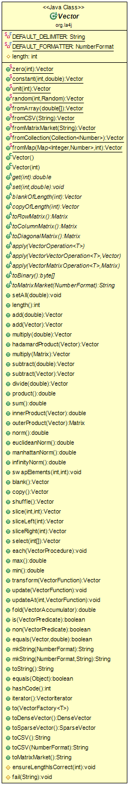

# Logical View

In this section of the report, we describe our system from its logical view. As the end-user of this project is a developer - since it is a library - we opted to choose the most important classes, generate their diagrams in UML using *ObjectAid UML Explorer*, and then describe them in enough level of detail to make the classes understandable without having to look at code directly.

The four components we chose - Matrix, Vector, Solvers and Inverter - can have their relationships described by a class diagram like this:

## Matrix

This class diagram shows all the constants, methods and functions that are used by the *Matrix* class to create, define and manipulate matrices as we understand them in an algebraic perspective.

The *Matrix* class contains, first of all, several final constants that are use as delimiters for the rows and columns of a matrix when we try to get its string representation. It also contains a default number format for output and 9 predefined indents for alignment.

With the constants covered, we can now give a brief description of the most important methods in the *Matrix* class. These are, after all, what lets the developer use, create and manipulate matrices.

Regarding the methods used for matrix creation, there are several ones we can consider important.

* *zero(int rows, int columns)* is a function that returns a matrix with the given rows and columns, filled with zeros. It is important to note that most of the methods used in matrix creation take in the number of columns and rows as an argument among other parameters that will specify the content of the matrix.

* *public Matrix(int rows, int columns)* creates an empty matrix with the given rows and columns. This constructor requires the matrix to be filled with abstract manipulative functions before it can be used.

* *constant(int rows, int columns, double constant)* is a similar function to the zero method, except it fills the defined matrix with a given constant.

* *Matrix random(int rows, int columns, Random random)* creates a matrix with a specified size filled with random numbers from a given range.

* *from2DArray(double[][] array)* creates a matrix from an 2D array of doubles.

* *Matrix fromCSV(String csv)* parses a CSV file and creates a matrix from the read input.

These are the methods we considered most important for matrix creation. We will now describe the most important abstract methods for matrix interaction and manipulation.

* *get(int i, int j)* is a method that lets us obtain an element of a matrix at a given index.

* *set(int i, int j, double value)* is a method that lets us set an element at a given index.

* *getRow(int i)* is a function used to get a row of the matrix and return it as a vector.

* *getColumn(int j)* is similar to getRow, but it returns a Column instead of a Row.

* *add(double value)* adds a given value to all the elements of the matrix.

## Vector

This diagram shows every function which the *Vector* class uses to work with vectors, allowing for vector creation and manipulation.

To start working with vectors, this class has the basic methods in which one can create a vector to further work with. You start by defining a vector and then you can use functions to do basic operations with your vector (add, multiply, etc). It is possible then to do matrix operations with vectors.

The most important methods are listed below:

* *zero(int)*: This function creates a vector with length (int), all elements with value 0. There are more functions to define different types of vectors for the needs of the user, for example, with constants, or from a list of values.

* *add(double)*, *multiply(double)*, etc:  These methods, along with more included in this class allow the user to use basic math
operations with vectors, such as multiplying/adding/dividing a vector by a scalar, etc.

* *norm()*, *innerProduct*, etc: It is possible to calculate some norm types of the vector (Euclidian, Manhattan, etc) and to return the innerProduct of a vector. You can also do operations with two vectors, such as the outer product and more.

* *mkString*: One can convert the vector/array to a string and vice-versa if it is in the supported format (CSV).

There are many more methods implemented in this class, almost all of which serve the same purpose as they do in the *Matrix* class.

## Solvers

This class diagram shows the classes which implement various methods for solving a system of linear equations. These classes can be instantiated through the *AbstractSolver* class. 

The *AbstractSolver* class has fields to contain the matrix, which corresponds to the system which we want to solve, the number of unknown variables and the number of equations. It also implements a constructor to store the Matrix object, upon instantiation, functions to obtain the fields corresponding to the number of variables, equations and to obtain the Matrix which is stored in it, and a function to test whether or not a given solution (in Vector form) is feasible. 

The solver classes inherit functions and fields from the *AbstractSolver* class. Each one of those classes contains a *solve* function, to execute the chosen algorithm over the system of equations, as well as an *applicableTo* function, used to check for linear algebra technicalities which could prevent a given system of being solved with a certain method. This standardization of the solver classes has to do with the fact that the implementations are done through the *LinearSystemSolver* interface, which requires the solvers to implement, at least, the aforementioned functions.

## Inverter

The GaussJordanInverter class holds the matrix we want to solve as a variable, and stores it in a constructor. It also implements the function inverse which verifies if the number of rows and columns is the same, and if so, checks if the matrix is invertible applying the Gaussian resolution. The class also possesses a function self which returns the matrix stored in it.

The NoPivotGaussInverter class has the same structure as the GaussJordanInverter class, but the function inverter implements Gaussian elimination without pivoting (Naive Gauss Elimination).

The classes are implemented through the MatrixInverter interface which forces the solvers to implement, at least, the functions self and inverse, making sure that any inverting method implementation is coherent with the rest and interchangeable.