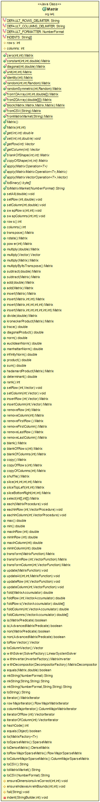

## Matrix

The previous class diagram shows all the constants,methods and functions that are used by the *Matrix* class to create,define and manipulate matrices as we understand them in an algebric prespective.

The *Matrix* class contains first of all, several final constants that are use the delimit the rows and columns of a matrix. It also contains a default number format for output and 9 predefined indents for alignment.

With the constants covered, we can now give a brief description of the most important methods in the *Matrix* class. These are after all, what lets ther use create and manipulate matrices using this class.

Regarding the methods used for matrix creation, there are several ones we can consider important.

*zero(int rows, int columns)* is a function that returns a matrix with the given rows and columns, filled with zeros. It is important to note that most of the methods used in matrix creation take in the number of columns and rows as an argument among other parameters that will specify the content of the matrix.

*public Matrix(int rows, int columns)* creates an empty matrix with the given rows and columns. This method requires the matrix to be filled with abstract manipulative functions before it can be used.

*constant(int rows, int columns, double constant)* is a similar function to the zero method, except it fills the defined matrix with a given constant.

*Matrix random(int rows, int columns, Random random)* creates a matrix with a especified size filled with random numbers from a given range.

*from2DArray(double[][] array)* creates a matrix from an 2D array of doubles.

*Matrix fromCSV(String csv)* parses a CSV file and creates a matrix from the read input.

These are the methods we considered most important for matrix creation, we will now describe the most important abstract methods for matrix interaction and manipulation.

*get(int i, int j)* is a method that lets us obtain an element of a matrix at a given index.

*set(int i, int j, double value)* is a method that lets us set an element at a given index.

*getRow(int i)* is a function used to get a row of the matrix and return it as a vector.

*getColumn(int j)* is similar to getRow, but it returns a Column instead of a Row.

*add(double value)* adds a given value to all the elements of the matrix.

