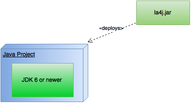

# Physical View



It is possible to use this library in any operating system, due to the fact that it is implemented in java.
The Java Development Kit (JDK 6 or newer) is necessary to be installed on the system. To make use of this
library, one needs to import the dependency throught Maven:

```xml
<dependency>
  <groupId>org.la4j</groupId>
  <artifactId>la4j</artifactId>
  <version>0.6.0</version>
</dependency>```
