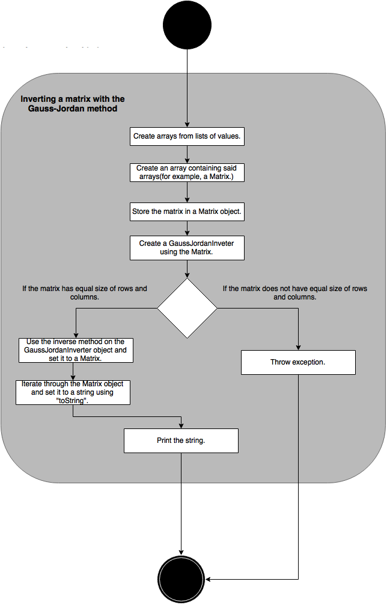

# Process View

In this section, we attempt to describe the internal workings of the project, explaining how it is able to do its main functionalities and how the classes and functions work with each other. We chose to describe the functional requirements listed in the Examples section for this, and we did so with the help of activity diagrams.

