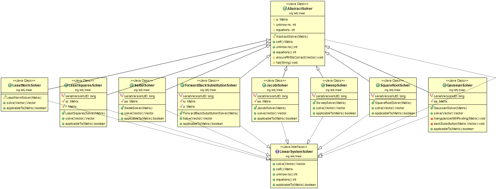

## Solvers

This class diagram shows the classes which implement various methods for solving a system of linear equations. These classes can be instantiated through the *AbstractSolver* class. 

The *AbstractSolver* class has fields to contain the matrix, which corresponds to the system which we want to solve, the number of unknown variables and the number of equations. It also implements a constructor to store the Matrix object, upon instantiation, functions to obtain the fields corresponding to the number of variables, equations and to obtain the Matrix which is stored in it, and a function to test whether or not a given solution (in Vector form) is feasible. 

The solver *per se* classes inherit functions and fields from the *AbstractSolver* class. Each one of those classes contains a *solve* function, to execute the chosen algorithm over the system of equations, as well as an *applicableTo* function, used to check for linear algebra technicalities which could prevent a given system of being solved with a certain method. This standardization of the solver classes has to do with the fact that the implementations are done through the *LinearSystemSolver* interface, which requires the solvers to implement, at least, the aforementioned functions.