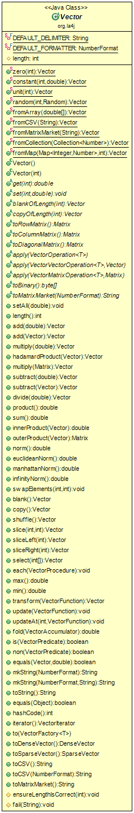

## Vector

This diagram shows every function which the *Vector* function use to work with Vectors, such as vector creation and manipulation.

To start working with vectors, this class has the basic methods in which one can create vector to futher work with. You start by
defining a vector and then you can then use functions to do basic operations with your vector (add,multiply, etc). It is possible
then to do matrix operations with vectors. It will be described in general the capabilities of this *Vector* class.

The most important methods are listed below:

* *zero(int)*: This function creates a vector with length (int), all elements with value 0. There are more functions to define a precise
vector for the needs of the user.

* *add(double)*, *multiply(double)*, etc:  These methods, along with more included in this class allow the user to use basic math
operations with vectors, such as multiplying/adding/dividing a vector by a scalar, etc

* *norm()*, *innerProduct*, etc: It is possible to calculate some norm types of the vector (Euclidian, Manhattan, etc) and to return
the innerProduct of a vector. You can also do operations with two vector, such as the outer product and more.

* *mkString*: One can convert the vector/array to a string and viceversa if it is in the supported format (CSV).

There are many more methods, all described in the java file to fill one's needs with vector operations.
